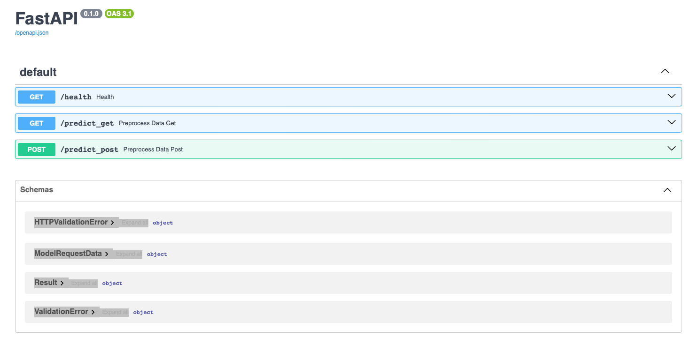
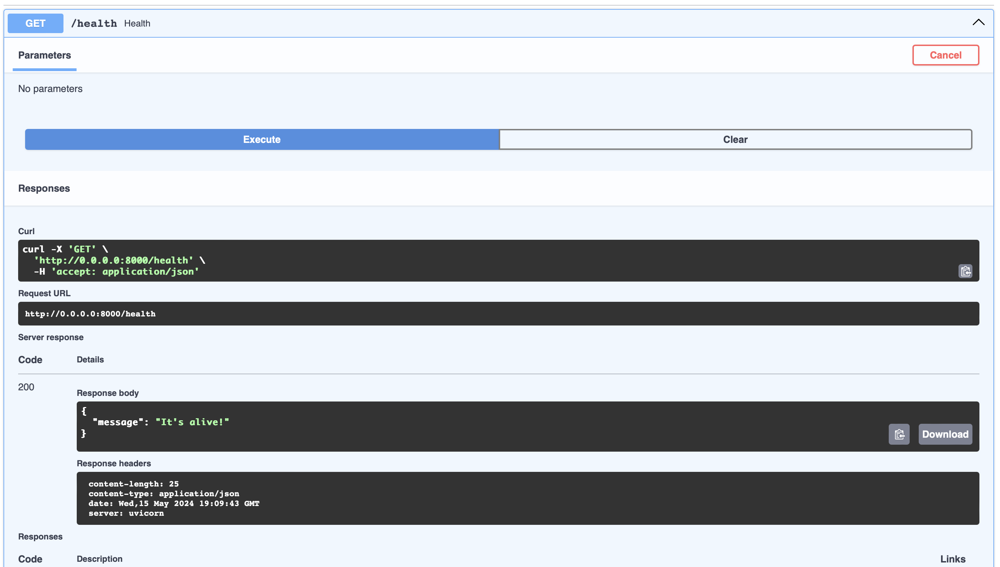
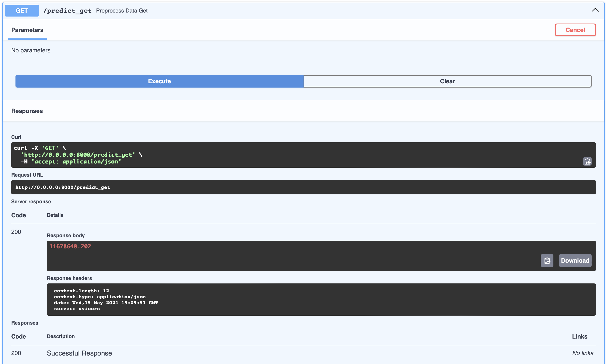
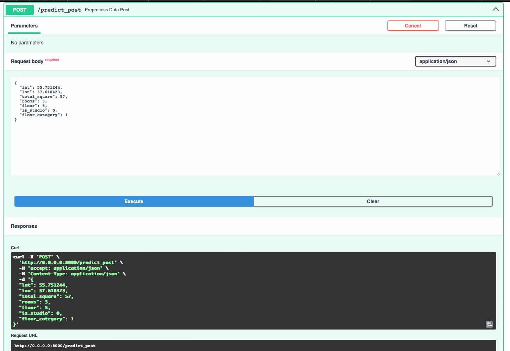
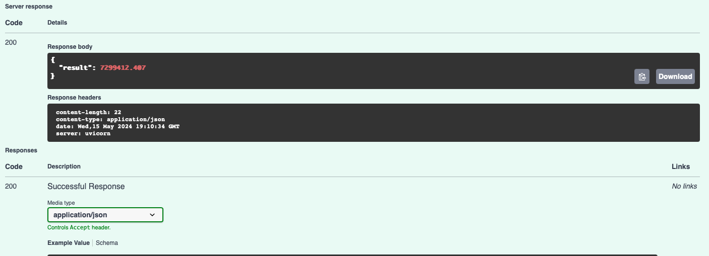

## ITMO Python DA course

Код к модулю 10 - Создание API

API на FastAPI для инференса модели предсказания показателя стоимости жилья

### Как запустить проект

Для запуска установите зависимости:

```pip install -r requirements.txt```

Запустите в корне проекта Uvicorn:

```uvicorn main:app```

### После запуска можно открыть документацию swagger (http://0.0.0.0:8000/docs#/)





Путь /health для проверки liveness probe, методом GET




Путь /predict_get для получения предсказания, методом GET




Путь /predict_post для получения предсказания, методом POST



